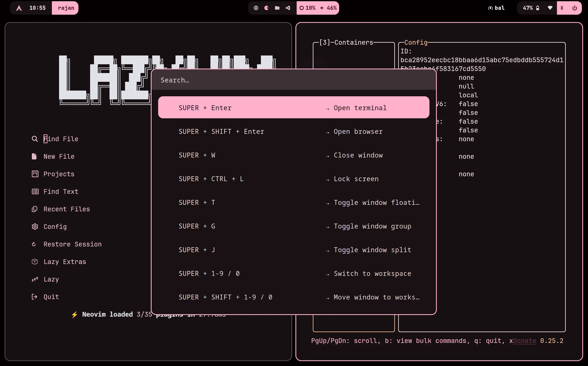
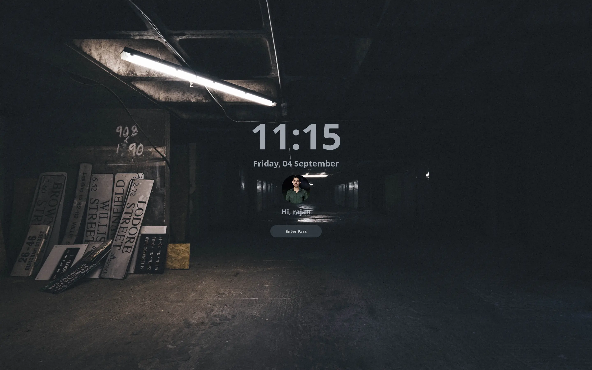

---

# Arch + Sway/SwayFX Dotfiles

A dynamic, wallpaper-driven Sway setup for Arch Linux. Change your wallpaper and the
entire system re-themes itself — Waybar, Rofi, Foot, Sway, GTK, Neovim, VS Code,
the browser, notifications, everything — through a Material You color pipeline built on
[matugen](https://github.com/InioX/matugen).

# Preview

https://github.com/user-attachments/assets/18fc7426-f8b7-4349-ae4f-4c4e70d48b56


## Table of contents

- [Overview](#overview)
- [Features](#features)
- [Waybar Presets](#waybar-prests)
- [Screenshots](#screenshots)
- [Requirements](#requirements)
- [Installation](#installation)
- [Post-install](#post-install)
- [Repo structure](#repo-structure)
- [Keybinds](#keybinds)
- [Theming system](#theming-system)
- [Wallpapers](#wallpapers)
- [Changing defaults](#changing-defaults)
- [Troubleshooting](#troubleshooting)
- [Credits](#credits)

## Overview

| Component    | Tool |
|--------------|------|
| OS           | Arch Linux (rolling) |
| Compositor   | Sway (SwayFX config — official `sway` works, `swayfx` from AUR enables corner_radius/blur/shadows) |
| Status bar   | Waybar (2 styles: noro / floating-bar, matugen colors) |
| Launcher     | Rofi (drun / run / window + menus) |
| Terminal     | Foot |
| Notifications| Mako (minimal, matugen colors, no center) |
| Shell        | Zsh + Oh My Zsh + autosuggestions |
| Editor       | Neovim (LazyVim) |
| Wallpaper    | awww + matugen |
| OSD          | SwayOSD |
| Idle/Lock    | swayidle + swaylock |
| System monitor| btop / fastfetch |

The repo is written for a laptop profile (Intel i5-13500H, Iris Xe, 2880x1800@90, 2x scale).
`config/sway/config` is a single documented file (ported from the Void SwayFX setup) —
monitors, autostart, look & feel, binds and window rules live in clearly marked
sections, and every `# > <text>` comment feeds the Super+K cheatsheet.

## Features

- **True dynamic theming** — one keybind (Super+R) changes the wallpaper and regenerates a
  Material You palette that propagates to every app that supports colors, live.
- **One static look, wallpaper-driven** — a single Sway decoration and set of
  Rofi menus, plus 2 Waybar styles (noro / floating-bar, Super+ALT+W); colors always follow
  the active wallpaper via matugen. No system theme packs.
- **Horizontal thumbnail carousel** — the wallpaper picker (Super+Ctrl+Space) opens an
  instant, centered Rofi carousel of image thumbnails (`image-carousel.rasi`) that you
  scroll with the arrow keys.
- **Omarchy-style quality-of-life**: scratchpad, workspace cycling, window groups,
  per-window transparency/gaps toggles, saved window sizes, monitor scaling on the fly,
  cursor zoom, universal Super+C/V clipboard that works in terminals too.
- **Media keys done right** — volume/brightness through SwayOSD overlays, mic mute,
  precise 1% steps, playerctl media controls.
- **Screenshots & recording** — region snip to clipboard, annotate with satty, full-screen
  grab, color picker, OCR extract, wf-recorder capture with a Waybar indicator.
- **Idle automation** — lock at 300s, display off at 360s, lock-on-lid-close.

## Waybar

Single top bar by default (`config/waybar/config.jsonc` + `style.css`, symlinked
into one of the presets); its colors come from the wallpaper via matugen
(`colors.css`). Switch between the 2 styles in `config/waybar/themes/` with
Super+ALT+W (noro, floating-bar). Toggle bar visibility with Super+Shift+Space.

---

## Waybar Presets
- noro

  

- bottom-dock

  

- cyber-left

  

- dynamic-island

  

- floating-bar

  

- glass-left

  

- glass-right

  

- gnome-left

  

- island

  

- mac

  

- minimal-left

  

- modern-left

  

- noro

  

- pill

  

---

## Screenshots

> | File | Shows |
> |------|-------|
> |  | Neovim (LazyVim, matugen colors) |
> |  | swaylock screen |

## Requirements

### Base system

- A working Arch Linux install (any arch-based distro works, scripts assume `pacman`/`yay`)
- Sway (official repo; `swayfx` from AUR unlocks the corner_radius/blur/shadows directives)

### Packages

Core (pacman):

```
sway swaybg swayidle swaylock autotiling waybar rofi foot swayosd
awww matugen fastfetch btop
grim slurp wl-clipboard cliphist hyprpicker wf-recorder satty
brightnessctl pamixer playerctl networkmanager
polkit-gnome xdg-desktop-portal-wlr xdg-desktop-portal-gtk
thunar wiremix tmux fzf starship
zsh-autosuggestions zsh-syntax-highlighting zsh-completions
```

Fonts and appearance:

```
ttf-jetbrains-mono-nerd ttf-nerd-fonts-symbols noto-fonts noto-fonts-cjk noto-fonts-emoji
papirus-icon-theme bibata-cursor-theme (bibata-cursor-theme-bin on AUR)
adw-gtk3 flat-remix-gtk-theme (or your preferred dark GTK theme)
qt5ct
```

From AUR (yay) — *only* these are required on top of `install.sh`:

```
yay -S yay-bin cloudflare-warp-bin cliamp-bin swayfx   # AUR helper + personal VPN + music player + SwayFX compositor
```

> Note: `install.sh` deliberately installs official-repo packages only.
> The list above is the manual remainder for an identical setup (also documented
> in `pkglist/foreign.txt`). Everything else — including the zsh plugins
> (`zsh-autosuggestions`, `zsh-syntax-highlighting`, `zsh-completions`) used by
> `shell/zshrc` — comes from `pkglist/native.txt` automatically.

Shell and editors (all handled by `./install.sh` from `pkglist/` — no manual setup):

- **Zsh**: no Oh My Zsh needed. `zshrc` sources `zsh-autosuggestions`,
  `zsh-syntax-highlighting` and `zsh-completions` (installed via pacman);
  `shell/zshrc` + `shell/bashrc` carry guarded inits for zoxide/fzf/atuin/direnv/starship
  (skipped silently if a tool is ever missing) and `shell/starship.toml` is linked
  to `~/.config/starship.toml`.
- **Neovim**: `pacman -S neovim` (plugins bootstrap themselves on first run via lazy.nvim)

### Optional extras the keybinds expect

- `arch-wallpaper-picker`, `arch-menu-images`,
  `capture-region`, `capture-screen`, `power-profiles`, `menu-emoji`,
  `menu-clipboard`, `ocr-extract`, `night-light-toggle`, `capture-satty` — personal
  helper scripts. The `arch-*` picker and the `capture-*` screenshot helpers ship in
  this repo under `bin/` (deployed to `~/.local/bin` by `install.sh`); the rest live in
  `~/.local/bin` and everything degrades gracefully if a script is missing (binds that
  call them just won't do anything).
- `pywalfox` — live-recolored Firefox/Brave via the pywalfox extension

## Installation

```bash
git clone https://github.com/rj9884/dotfiles.git ~/dotfiles
cd ~/dotfiles
./install.sh
```

The script (one go on a minimal Arch install — packages first, then configs):

1. Installs packages: bootstraps `archlinux-keyring`/`git`/`base-devel`, then every
   missing package from `pkglist/native.txt` (official pacman repos, incl. sway, waybar, matugen)
2. Backs up any existing config dirs it replaces (into `~/.config-backup-<timestamp>`)
   and symlinks every app config from `config/` into `~/.config/`
3. Symlinks shell files (`zshrc`, `bashrc`, `gitconfig`) into `$HOME` and
   `starship.toml` into `~/.config/starship.toml`
4. Checks the single static look (one Sway/Waybar/Rofi style; colors come
   from the wallpaper via matugen)
5. Installs the single flat wallpaper library into
   `~/.local/share/wallpapers` (from the `Wallpaper/` set of the
   separate [wallpapers repo](https://github.com/rajan9884/wallpapers))
6. Links helper scripts from `bin/` into `~/.local/bin` and wires the rofimoji theme
7. Installs a `pactl`→`wpctl` shim only on PipeWire machines without real
   pactl (so the volume OSD works; untouched when real pactl exists)
8. Runs matugen once so every app starts with the right palette
9. Enables resilience services (power-profiles-daemon, autoswitch, ufw, powertop)
10. Verifies every binary, wallpaper set, symlink and generated palette —
    exits nonzero with the exact fix if anything is missing

Re-running is safe: symlinks are refreshed, real files are backed up, nothing is deleted.

## Post-install

1. Log out and log back in selecting the **Sway** session (or run `start-sway` on TTY1).
2. Press `Super+K` any time for a keybind cheatsheet.
3. First Neovim launch will install plugins (LazyVim extras: Go, Markdown, JSON).
4. Set your browser theme via the pywalfox extension if you use Firefox/Brave.

## Repo structure

```
dotfiles/
├── install.sh                  # one-shot setup (safe to re-run)
├── bin/
│   ├── arch-wallpaper-picker   # wallpaper picker (rofi carousel) → ~/.local/bin
│   └── *                        # screenshot, clipboard, webapp, wifi helpers → ~/.local/bin
├── scripts/
│   └── systemd/                # optional system services (powertop)
├── config/
│   ├── sway/
│   │   ├── config              # sway/swayfx entry (monitors, autostart, look, binds, rules)
│   │   ├── colors              # matugen-generated palette (do not edit)
│   │   ├── swayidle.conf       # idle: dim 150s, lock 180s, off 240s, suspend 600s
│   │   ├── swaylock-config     # lock screen (matugen-generated)
│   │   ├── scripts/            # helper scripts (wallpaper, windows, media, portals)
│   ├── mako/                   # notification daemon (static config + matugen colors)
│   ├── xdg-desktop-portal/     # portal routing (wlr screencast/screenshot, gtk files, gnome-keyring secret)
│   ├── waybar/
│   │   ├── modules.jsonc        # shared module definitions
│   │   ├── scripts/             # wifi/bt/power menus, recorder, vpn...
│   │   └── themes/              # 2 waybar styles (noro, floating-bar — Super+ALT+W)
│   ├── rofi/
│   │   ├── config.rasi          # drun/run/window launcher
│   │   ├── theme.rasi           # dmenu-style picker (matugen colored)
│   │   ├── power-menu.rasi etc. # dashboard menus
│   │   ├── image-carousel.rasi  # thumbnail carousel for the wallpaper picker
│   ├── foot/foot.ini            # fonts, padding, clipboard passthrough
│   ├── matugen/
│   │   ├── config.toml           # which apps get generated colors
│   │   └── templates/            # 21 color templates (the theming engine)
│   ├── nvim/                     # LazyVim: options, keymaps, matugen colorscheme
│   ├── btop/btop.conf
│   └── gtk-3.0/ gtk-4.0/         # settings.ini (theme, icons, cursor)
├── shell/
│   ├── zshrc bashrc              # Arch-style shells (guarded tool inits)
│   ├── starship.toml             # prompt theme (~/.config/starship.toml)
│   └── gitconfig                 # identity + defaults (shared credential store)
```

## Keybinds

`Super` = the Windows/Command key.

### Essentials

| Bind | Action |
|------|--------|
| Super+Return | Foot |
| Super+Space | Rofi launcher |
| Super+Shift+B | Browser (helium) |
| Super+Shift+Alt+B | Private browser window |
| Super+Shift+N | Editor (foot + nvim) |
| Super+Alt+Return | Terminal with tmux |
| Super+Shift+F / Super+E | File manager (Thunar) |
| Super+W / Super+Q | Close window (graceful) |
| Super+CTRL+L | Lock (swaylock) |
| Super+Escape | Power menu |
| Super+K | Keybind cheatsheet |

### Wallpaper & utilities

| Bind | Action |
|------|--------|
| Super+R | Random wallpaper (full re-theme) |
| Super+CTRL+Space | Wallpaper picker |
| Super+ALT+W | Waybar style toggle (noro / floating-bar) |
| Super+period | Emoji picker |
| Super+CTRL+E | Emoji/symbol alt |
| Super+CTRL+Q | Calculator |

### Windows & workspaces

| Bind | Action |
|------|--------|
| Super+H/J/K/L or arrows | Focus (vim-style) |
| Super+Shift+arrows | Swap window |
| Super+T | Toggle float |
| Super+O | Pop out window (float + pin) |
| Super+F / Super+ALT+F | Fullscreen / maximized |
| Super+S | Toggle scratchpad |
| Super+ALT+S | Send to scratchpad |
| Super+G | Toggle tabbed group |
| Super+ALT+G | Move window out of group |
| Super+ALT+arrows | Split horizontal/vertical |
| Super+J | Toggle split layout |
| Super+TAB / Super+Shift+TAB | Next / previous workspace |
| Super+1..0 | Workspace 1-10 |
| Super+Shift+1..0 | Move window to workspace |
| Super+Shift+Space | Cycle waybar visibility |
| Super+BACKSPACE | Toggle window transparency |
| Super+Shift+BACKSPACE | Toggle gaps |
| Super+Home | Restore saved window size |
| Super+ALT+Home | Save window size |
| Super+SLASH | Keybind cheatsheet (also Super+K) |
| Super+CTRL+ALT+Up/Down | Monitor scale up / down |

### Screenshots & media

| Bind | Action |
|------|--------|
| Print | Snip region to clipboard |
| Super+Shift+S | Snip + annotate (satty) |
| Super+Shift+Print | Full screen to clipboard |
| Super+Print | Color picker |
| ALT+Print | Screen recording toggle |
| Super+CTRL+Print | OCR extract |
| Super+CTRL+V | Clipboard history |
| XF86 keys | Volume/brightness (via SwayOSD) |
| Shift+XF86Brightness | Max / min brightness |
| ALT+XF86Brightness | Precise 1% steps |
| XF86AudioPlay/Next/Prev | Media controls |
| XF86AudioMicMute | Mic mute |
| XF86TouchpadToggle | Toggle touchpad |

### Notifications

| Bind | Action |
|------|--------|
| Super+comma | Dismiss notification |
| Super+Shift+comma | Dismiss all |
| Super+CTRL+comma | Toggle do-not-disturb |

### Universal clipboard

| Bind | Action |
|------|--------|
| Super+C / Super+V | Copy / paste (works in terminals) |
| Super+X | Cut |

## Theming system

The pipeline, in one line:

```
wallpaper -> awww (set) -> matugen (palette) -> 21 templates -> every app
```

1. **`sway-wall.sh <image>`** is the entrypoint (used by every wallpaper script).
2. It sets the wallpaper via awww and runs `matugen image <image> -c ~/.config/matugen/config.toml` which renders the
   templates in `config/matugen/templates/` into live config files:
   `~/.config/waybar/colors.css`, `~/.config/sway/colors`, `~/.config/sway/swaylock-config`,
   `~/.config/foot/colors.ini`, `~/.config/mako/colors`,
   GTK css, `~/.config/fastfetch/config.jsonc`,
   `~/.config/nvim/lua/matugen-colors.lua`,
   `~/.config/ghostty/config`, swayosd css, btop theme, VS Code colors, a
   Brave/Firefox browser theme, and more.
3. It then pokes each app to reload: `killall -SIGUSR2 waybar`, swaymsg reload,
   makoctl reload, restart swayosd, refresh pywalfox.

Because the *generated* files live on disk but are gitignored, a fresh install boots with
the palette the install script generated — and any wallpaper change re-themes everything
in about a second.

### Static look + wallpaper colors

- The **static look** is fixed: `config/sway/config` (gaps, borders, swayfx effects)
  and the Rofi styles (`config/rofi/active-*.rasi`, `image-carousel.rasi`, ...).
- **Waybar has 2 switchable styles** (`config/waybar/themes/<name>`, Super+ALT+W);
  whichever is active gets its colors from the wallpaper the same way.
- **Colors always follow the wallpaper**: any wallpaper change runs matugen and
  re-tints every app. There are no theme packs or style switchers.

## Wallpapers

- Live location: `~/.local/share/wallpapers/` — one flat library, no
  subfolders (XDG data dir — safe from home-dir cleanup; all scripts point here)
- Source: the `Wallpaper/` set of the separate
  [wallpapers repo](https://github.com/rajan9884/wallpapers) — `install.sh` clones
  it to `~/.local/share/wallpapers-upstream` and installs the flat set. Override
  with `WALLPAPER_SOURCE=/path/to/wallpapers ./install.sh`.

## Changing defaults

| Want to change | Edit |
|----------------|------|
| Monitor, scale, refresh | `config/sway/config` — `output ...` section |
| Terminal/browser/file manager | `config/sway/config` — `$term`, `$browser`, `$file` variables |
| Fonts | `config/foot/foot.ini`, `config/waybar/style.css` |
| Idle timings | `config/sway/swayidle.conf` |
| Which apps get themed | `config/matugen/config.toml` |
| Colors of a given app | matching template in `config/matugen/templates/` |

## Troubleshooting

- **Colors look stale after a wallpaper change** — run `matugen image <wallpaper>
  -c ~/.config/matugen/config.toml` manually and check for template errors.
- **Waybar didn't reload** — `killall -SIGUSR2 waybar` or just restart waybar.
- **Rofi shows wrong colors** — the `active-*.rasi` files live in `~/.config/rofi/`;
  re-run `./install.sh` to re-check them (they are tracked real files now).
- **GTK apps don't recolor** — GTK4 apps read css at launch; restart the app.
- **Keys like XF86TouchpadToggle don't work** — check your laptop's Fn-lock; binds are on
  the raw XF86 symbols.
- **Everything is broken after install** — your old configs are in
  `~/.config-backup-<timestamp>`; restore and open an issue.

## Credits

- [Sway](https://swaywm.org) / [SwayFX](https://github.com/WillPower3309/swayfx) — the compositor
- [matugen](https://github.com/InioX/matugen) — Material You color generation
- [LazyVim](https://www.lazyvim.org) — Neovim distribution
- [Oh My Zsh](https://ohmyz.sh) + zsh-autosuggestions
- [Papirus](https://github.com/PapirusDevelopmentTeam/papirus-icon-theme) icons,
- [Bibata](https://github.com/ful1e5/Bibata_Cursor) cursors
